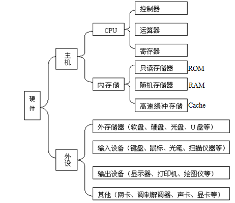

## 计算机特点与应用范围

- ### 计算机的特点:
   > 速度快、存储容量大、精度高、全自动工作、具有逻辑判断能力、可靠性强、通用性强

- ### 计算机的应用范围：
   > - `最早` 应用于 `科学计算`：天气预报、人造卫星、地震分析、航天技术等
   > - 过程控制：实时控制
   > - 数据处理：办公自动化、大部分应用
   > - 计算机辅助功能：CAD、CAI、CAM、CAT
   > - 人工智能：模拟人的智能：如 `机器人`
   > - 网络与通信
   > - 数字娱乐
   > - 嵌入式系统

- ### 计算机的发展：
   > - 1946年 -> 美国 -> 第一台计算机 -> `ENIAC` (5000次/秒)
   > 
   > - 按照 `电子元件` 的不同，将计算机的发展分为四个时代
   >     - 第一代：`电子管` (1946 --- 1958) --- 用于计算
   >     - 第二代：`晶体管` (1958 --- 1964)
   >     - 第三代：`集成电路` (1964 --- 1971)
   >     - 第四代：`大规模或超大规模集成电路` (1971 --- 至今) --- PC(微机)
   > 注: `Internet 最早起源于 (20世纪60年代末期)`

- ### 计算机的分类

   | 类型 | |
   | --- | -- |
   |按 `信息形式` 可分为 | `数字计算机`、`模拟计算机`、`数字模拟混合计算机` |
   |按 `用途` 可分为 | `通用计算机`、`专用计算机` |
   |按 `功能` 可分为 | `微机`、`小型机 (终端)`、`中型机`、`大型机`、`巨型机` |

- ### 计算机的发展趋势
   > 巨型化(功能) ---> 微型化(体积) ---> 网络化(适应网络发展) ---> 多媒体化 ---> 智能化

## 计算机系统的基本组成

- ### 冯·诺依曼原理：
> - 五大基本部件：`运算器`、`控制器`、`存储器`、`输入设备`、`输出设备`
> - 二进制：表示 `数据` 和 `指令`
> - 程序存储，自动运行

- ### 硬件系统
  - 简述计算机硬件系统的组成及各部件之间是如何协调工作的：
    > 硬件系统主要包括 `控制器`、 `运算器`、 `存储器`、 `输入设备`、 `输出设备`、 `接口` 和 `总线` 。各个部件之间依照 `冯诺依曼原理` 协调工作，通常将 `程序和数据` 先存放在计算机的 `存储器` 中，计算机在程序的控制下依靠 `控制器和运算器` 完成 `算术和逻辑运算` ，并将结果通过`输出设备` 显示，用户通过 `输入设备` 向计算机输入数据或指令，各个设备之间通过 `总线和接口` 连接。
  - 主机
    1. CPU (中央处理器)，它是计算机的核心部件。主要是由以下三部分构成的：
         - `运算器` (ALU: Arithmetic and Logic Unit)：进行二进制的 `算术运算` 、 `逻辑运算`。
         - `控制器`：控制与协调各部件自动、连续地执行各条指令。
           - 指令是由 `操作码` 和 `地址码` 两部分组成。
         - `寄存器`
    2. 存储器：用于存放 `数据和程序`，包括：`内存储器` 、`外存储器`。
         - `内存储器`，又可简称为 `内存`，主要分为两类：
           - `ROM (只读存储器)`，又称为 `CMOS`，主要有以下特点：
             - 存放引导程序及机器参数
             - 只读不写
             - 断电信息不丢失
           - `RAM (随机存储器)`，主要有以下特点：
             - 可读写
             - 暂存数据
             - 速度快 --- 相对 `外存储器`
             - 断电信息丢失 --- 要存盘
         > - 通常所说`内存2.0G` 指的是 `RAM` 的容量为 2.0G
         > - 存盘实质：将 `RAM` 中的信息保存到外存（软盘、硬盘、光盘、U盘）上。
    3. 总线：是 `微机` 中为 `CPU` 与 `其他部件` 提供数据、地址和控制信息的传输通道：
         - 地址总线 (AB)：只传输地址信号
         - 数据总线 (DB)：只传输数据信号
         - 控制总线 (CB)：只传输控制信号
    4. IO 接口电路：连接主机和外设
    5. `Cache` 主要是为了解决 CPU 和 内存速度不匹配的问题
    6. `CPU` 可以直接访问 `RAM`、`ROM`、内存，可以间接访问外存，如 `硬盘` 和 `U盘`
  - 外设
    1. 外存(辅助存储器):
      > 特点：`速度低`、`容量大`、`价格低`、`数据永久保存`
      比如：
      > - 硬盘：
      >   - 容量大（160G，1TB）
      >   - 转速：（5400转/分钟、7200转/分钟）
      >   - 盘符从C开始
      > - 光盘：
      >   - 普通CD标准容量650MB，DVD可达4.7GB
      >   - 数据轨道不是同心圆，是螺旋线
      >   - 速度：
      >     - 单速：150 KB/s
      >     - 倍速：300 KB/s
      >     - 40速：40*150 KB/s
      >   - 类型：
      >     - CD-R→只写一次光盘
      >     - CD-ROM→只读光盘
      >     - CD-RW→可重写光盘   
      > - 优盘：
      >   - USB口（通用串行总线接口）
      >   - 速度：
      >     - 软盘速度的 20 倍
      >     - USB2.0 速度可达 480 Mb/s

      > 注：速度比较：CPU > Cache（高速缓存）> RAM（内存） > 硬盘 > 光盘 > 软盘
  - 输入输出设备
    > 作用：实现计算机与用户之间信息传递的设备
    - 输入设备
      > `键盘`、`鼠标`、`数码相机`、`麦克`、`触摸屏`、`光笔`、`摄像头`、`扫描仪`
    - 输出设备
      > - `显示器`：
      >   - 21英寸显示器指屏幕对角线长度为21英寸
      >   - 分辨率设置为 `1024*768` 时，指屏幕图像水平方向分为 `1024` 个像素点，垂直方向为 `768` 个像素点
      >   - 评价显示器的指标有：`刷新频率`、`分辨率`、`点距`，`没有可靠性和精度`
      > - `打印机`：分为两大类：`击打式和非击打式` 和 `针式、喷墨、激光`
      > - `绘图仪`
      > - `音响`
  - 其他
    - `Modem` → 调制解调器（相互）
      - 调制：将 `数字信号` 转换为 `模拟信号`
      - 解调：将 `模拟信号` 转换为 `数字信号`
      > 注意：
      > - 硬盘、U盘、软盘驱动器、刻录机 既是 `输入设备` 又是 `输出设备`
      > - CD-ROM驱动器、DVD-ROM驱动器仅仅是 `输入设备`

- ### 软件系统
  > 包括 `程序`、`数据`、`文档`   
  > 指令：计算机执行操作的命令，由 `操作码` 和 `地址码` 组成   
  > 程序：一组能完成特定功能的指令序列，用计算机语言编写程序
  - 计算机语言
    - 低级语言
      - 机器语言：只有 `0` 和 `1`，也是计算机唯一能直接识别的语言
      - 汇编语言
    - 高级语言
      - `FOXPRO`、`C`、`BASIC`、`VB`、`JAVA`
  - 软件
    - 应用软件：应用软件是利用计算机和系统软件解决具体问题所编制的各种程序。如 `Word` 、`WPS` 等。
    - 系统软件：管理、维护计算机，保障计算机正常运行的程序。如：
      - 操作系统：用户与计算机之间的接口，如：`DOS`、`Windows`、`UNIX`、`Linux`、`Netware`
      - 语言处理程序：`汇编程序`、`解释程序`、`编译程序（目标程序）`、`连接程序（可执行程序）`
      - 服务程序(系统支持软件)：`监控程序`、`诊断程序`、`调试程序`
      - 数据库管理系统：`DBMS`、`网络管理软件`
      - 程序设计语言

## 微机系统组成与主要技术指标

- ### 微机系统组成
  
  
- ### 计算机系统的主要技术指标
  - 字长：越长，精度越高，处理能力也越强
    > 计算机在 `同一时间内` 处理的一组二进制数称为计算机的 `字`，这组二进制数的位数称为 `字长`
  - 主频：（单位：MHz）每个时钟周期，CPU能完成的操作次数
  - 主存容量：指内存容量，内存容量越大，功能就越强，能处理的数据量就越大（容量大，速度快）512MB、1GB
  - 软件、硬件系统配置
  - 兼容性
  - 运算速度：每秒种完成指令的条数。
    - MIPS：millions of instructions / second
    - BIPS：Billions of instructions/second
    - 1000MIPS = 1BIPS
  > 注：`切记，没有外存容量`

- ### 数据单位及换算，`重点`
  - `位` (bit--b) --- 最小存储单位
  - `字节B` (Byte)  --- 存储器容量的最基本单位, 1B = 8bit
  - `字长` (word length) --- 4位 → 8位 → 16位(286) → 32位(486) → 64位